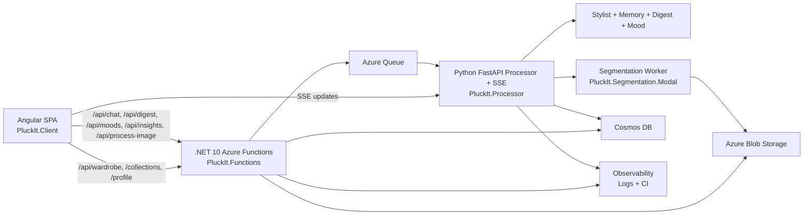
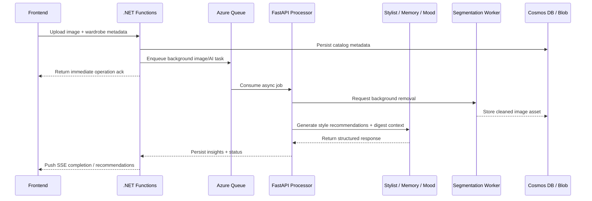

# PluckIt — AI-Powered Personal Wardrobe

PluckIt is an AI-powered wardrobe stylist platform I built:
a cohesive Angular frontend, .NET/Python backend services, and a production-style architecture unified in one codebase.

## Why I built it
- I wanted a real application where users can organize wardrobe data and get meaningful AI suggestions.
- I wanted to combine frontend, backend, AI, and asynchronous processing in one coherent product.
- I wanted to demonstrate clean boundaries between domain logic, infrastructure, and serving layers.

## What the product does
- Upload and catalog clothing items with metadata and search/filter capabilities.
- Create collections to group outfits and related items.
- Track wear events and derive quick wardrobe usage insights.
- Chat with an AI stylist that is aware of closet content and context.
- Generate a weekly fashion digest with lightweight feedback-based adjustment.
- Process clothing images through AI background removal before they are stored.

## Build

### Frontend
- Angular 19+ SPA with standalone components and Signals for local state.
- Responsive wardrobe management views for browsing, editing, and analytics.
- Streaming stylist chat client for AI responses.

### API and data services
- .NET 10 isolated Azure Functions for the public API surface.
- FastAPI running in Azure Functions for processor-focused endpoints and SSE behavior.
- Queue-driven background workflow to keep long AI/image tasks out of the user request path.
- Cosmos DB and Azure Blob Storage as the primary persistence layer.

### AI and async processing
- ReAct-style styling assistant with tool calls for contextual recommendations.
- Dedicated AI image segmentation path for cleaner catalog photos.
- End-to-end telemetry and logs across services for traceability.

## Architecture at a glance

## Technology Choices & Rationale

- **Angular 19+ (Signals + Standalone Components)** to keep frontend code organized and fast for dynamic wardrobe views.
- **.NET 10 Azure Functions** as the API edge because isolated process functions keep startup fast and let the public surface stay cleanly structured.
- **Python FastAPI in Azure Functions** for processor workloads requiring async patterns and SSE streams.
- **Queue-driven processing + workers** so image-heavy AI jobs run asynchronously and do not block user actions.
- **Azure Cosmos DB + Blob Storage** to support flexible item schema evolution and efficient media storage.
- **Modal-hosted BiRefNet segmentation** to keep heavy model inference isolated from core platform services and reduce operational complexity.
- **Terraform** to keep infrastructure changes reviewable, reproducible, and auditable.

## Azure Infrastructure (High level)

- Azure Static Web App: frontend hosting with CDN and HTTPS.
- Azure Functions (Flex Consumption): API and processor endpoints.
- Azure Storage Queue: async orchestration between API and background processors.
- Cosmos DB NoSQL + Blob Storage: domain data and image assets.
- Monitoring and logging: telemetry/alerts for request + background job visibility.
- Azure OpenAI + Modal: AI and segmentation execution endpoints.

## Cost Summary

- Target personal usage budget: **under \$20/month** for a single-project, low-to-moderate workload.
- This is a **total monthly budget estimate**, not a per-user cost.
- Cost-control levers:
  - Keep Function Apps in serverless modes to avoid idle compute.
  - Use LRS Blob storage where cross-region replication is not required.
  - Choose `gpt-4.1-mini` for lower token cost on stylist/digest workloads.
  - Use Modal scale-to-zero segmentation so GPU spend follows actual usage.
- Estimated monthly cost by service:

| Resource | Tier / Model | Est. monthly cost |
| --- | --- | --- |
| Azure Static Web App | Free tier | \$0 |
| Cosmos DB NoSQL | Free tier (RU/storage included) | \$0 |
| Azure Functions — API | Flex Consumption | \$0–2 |
| Azure Functions — Processor | Flex Consumption | \$0–2 |
| Azure Blob Storage | Standard LRS | \$1–3 |
| Storage Queue | Included with account | \$0 |
| Log Analytics + telemetry on Grafan Cloud | Standard retention settings | \$0 |
| Azure OpenAI (`gpt-4.1-mini`) | Usage-based pay-per-token | \$1–10 |
| Modal BiRefNet segmentation | GPU scale-to-zero | \$0–5 ($30 free credit per month) |

**Estimated total: \<\$10/month** for typical personal-use traffic. Can scale per user (estimates pending but will assume storing 100+ clothes + using stylist AI chat frequently)

## CI/CD — GitHub Actions

- Pull requests trigger validation builds/tests and infra planning.
- Production branches trigger deployment workflows for infra, API, processor, frontend, and segmentation services.
- Queue and deployment jobs are organized to avoid race conditions during infra + app rollouts.
- Infrastructure and runtime are deployed from code; manual portal/CLI drift is minimized.

## Engineering highlights
- Built and maintained a clean module split across `PluckIt.Core`, `PluckIt.Infrastructure`, `PluckIt.Functions`, `PluckIt.Processor`, and `PluckIt.Client`.
- Designed for async image and AI workflows without blocking core user interactions.
- Used domain-driven layering to keep services testable and maintainable.
- Used CI and infrastructure automation so changes are repeatable and reviewable.
- Added tests for core behavior paths and shared service contracts.

## Repository map
- `PluckIt.Client/` — Angular frontend application.
- `PluckIt.Core/` — Domain models and service contracts.
- `PluckIt.Infrastructure/` — Storage, database, and external integrations.
- `PluckIt.Functions/` — .NET API and orchestration layer.
- `PluckIt.Processor/` — Async processors and AI-facing endpoints.
- `PluckIt.Segmentation.Modal/` — AI background removal worker.
- `PluckIt.Tests/` — test suite.
- `infra/` — infrastructure definitions (kept separate from this overview).

## Native clients
- iOS + macOS app repositories are maintained separately at [Pluck-It.Apple](https://github.com/AB-Law/Pluck-It.Apple), covering Swift-based mobile and desktop clients.

## Current status
- Core wardrobe, AI styling, and insights features are implemented end-to-end.
- System supports both interactive chat and asynchronous background tasks.
- Ongoing improvements include UX polish, additional recommendations logic, and expanded test coverage.
